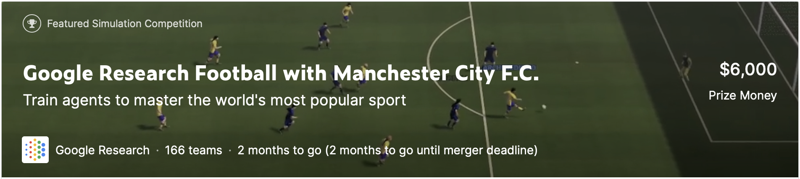

# Google Research Football with Manchester City F.C.

competition link is [here](https://www.kaggle.com/c/google-football)

## Rules
### 基本ルール
11人チームの1人のプレイヤーを操作可能  
ルールは公式のサッカーとほとんど同じ(オフサイド、イエローカード、レッドカード)  
しかし僅かながら違いがある

- ゲームは2つのハーフ、45分（1500 steps）ずつで構成。(つまり1step=1.8s)
各ハーフの開始時のキックオフは別のチームで行われるが、サイドの入れ替えはなし（ゲームは完全に左右対称です）。
- 各エージェントは、チーム内の1人の選手をコントロール。コントロールされたプレイヤーは、**常にボールを持っているプレイヤー、または守備時にボールに近いプレイヤーとなる。**
- ゲーム中にチームがサイドを入れ替えることはない。左右のサイドはランダムに割り当てられる。
- エージェント実装の便宜上，提供されるオブザベーションは，**エージェントが左チームをコントロールしているかのように常に表示される**．
- 環境は、観察とアクションの両方に適切な変換を適用する。ゲームエンジンは完全に対称的であるため、左右の入れ替えはゲームに影響を与えない。
- 非カップスコアリングルールが適用され、より多くのゴールを決めたチームが勝ち。
- チームの選手数が7人以下になった場合、ウォークオーバーは適用されません。
- 交代選手は存在しない。
- 延長戦は適用されない。

### オブザベーションと行動
各ターンで、エージェントは現在のスコア、全プレイヤーの位置、プレイヤーのスピード、疲労度を含むゲームの完全な状態を表すオブザベーションを受け取る。
オブザベーションの詳細なフォーマットは[こちら](https://github.com/google-research/football/blob/master/gfootball/doc/observation.md#raw-observations)  
各ターンで、エージェントはデフォルトのアクションセットから19のアクション（0から18までの番号）のうちの1つを生成する。
アクションセットの外のアクションを返すとエージェントの損失となる。
[参考](https://github.com/google-research/football/blob/master/gfootball/doc/observation.md#default-action-set)

### ゲーム終了
3000ターン後、またはエージェントのどちらかがエラーを起こした場合(タイムアウト、例外が投げられた場合、無効なアクションが返された場合)にゲーム終了。
エラーを起こしたエージェントが負け、他のエージェントが勝つ。エラーがなかった場合は、より多くのゴールを獲得したチームが勝ち。
ランキングは評価ルールに従って更新。

## Reference
[1][Google Research Footballに関する論文](http://arxiv.org/abs/1907.11180)
[2][SEED RL](https://arxiv.org/abs/1910.06591)
強化学習手法のベースラインとしてはじめに与えられている手法。

[3]PFRL(PyTorchの強化学習フレームワーク)
[GitHub](https://github.com/pfnet/pfrl), [docment](http://pfrl.readthedocs.io/en/latest/index.html)