# Google Research Football with Manchester City F.C.


competition link is [here](https://www.kaggle.com/c/google-football)

---
## Contribution

### Competition
Final Score 59th(🥉)
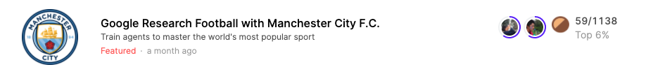
  
  
### Notebook (🥈1🥉1)
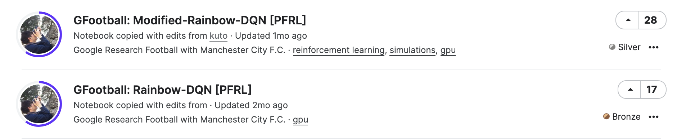
  

### Discussion (🥇2🥉3)
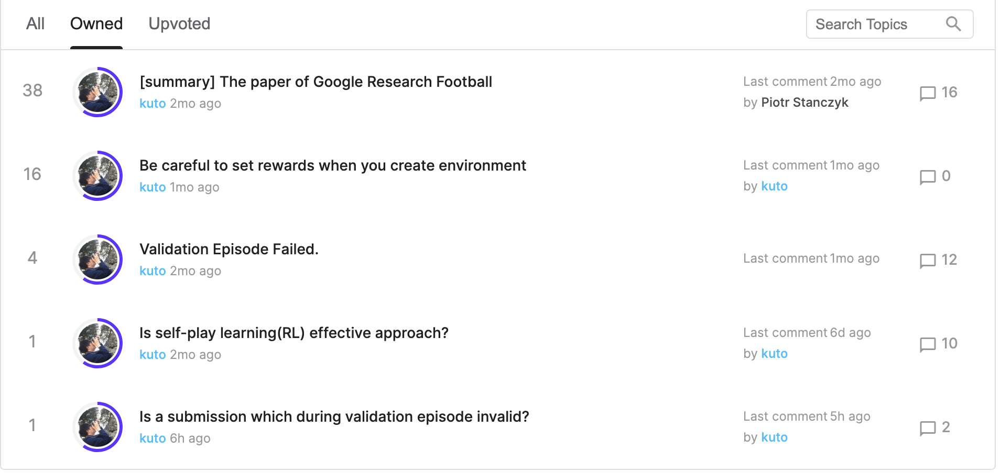

---

## Rules
### 基本ルール
11人チームの1人のプレイヤーを操作可能  
ルールは公式のサッカーとほとんど同じ(オフサイド、イエローカード、レッドカード)  
しかし僅かながら違いがある

- ゲームは2つのハーフ、45分（1500 steps）ずつで構成。(つまり1step=1.8s)
各ハーフの開始時のキックオフは別のチームで行われるが、サイドの入れ替えはなし（ゲームは完全に左右対称です）。
- 各エージェントは、チーム内の1人の選手をコントロール。コントロールされたプレイヤーは、**常にボールを持っているプレイヤー、または守備時にボールに近いプレイヤーとなる。**
- ゲーム中にチームがサイドを入れ替えることはない。左右のサイドはランダムに割り当てられる。
- エージェント実装の便宜上，提供されるオブザベーションは，**エージェントが左チームをコントロールしているかのように常に表示される**．
- 環境は、観察とアクションの両方に適切な変換を適用する。ゲームエンジンは完全に対称的であるため、左右の入れ替えはゲームに影響を与えない。
- 非カップスコアリングルールが適用され、より多くのゴールを決めたチームが勝ち。
- チームの選手数が7人以下になった場合、ウォークオーバーは適用されません。
- 交代選手は存在しない。
- 延長戦は適用されない。

### オブザベーションと行動
各ターンで、エージェントは現在のスコア、全プレイヤーの位置、プレイヤーのスピード、疲労度を含むゲームの完全な状態を表すオブザベーションを受け取る。
オブザベーションの詳細なフォーマットは[こちら](https://github.com/google-research/football/blob/master/gfootball/doc/observation.md#raw-observations)  
各ターンで、エージェントはデフォルトのアクションセットから19のアクション（0から18までの番号）のうちの1つを生成する。
アクションセットの外のアクションを返すとエージェントの損失となる。[(参考)](https://github.com/google-research/football/blob/master/gfootball/doc/observation.md#default-action-set)


### ゲーム終了
3000ターン後、またはエージェントのどちらかがエラーを起こした場合(タイムアウト、例外が投げられた場合、無効なアクションが返された場合)にゲーム終了。
エラーを起こしたエージェントが負け、他のエージェントが勝つ。エラーがなかった場合は、より多くのゴールを獲得したチームが勝ち。
ランキングは評価ルールに従って更新。

---

## log

### [2020/09/30]
discussionにGRF論文の内容を投稿　
https://www.kaggle.com/c/google-football/discussion/187657

[公式からのdiscussion](https://www.kaggle.com/c/google-football/discussion/187381)より
- validation episodeが75分ととても長いこと
- windows上では環境がうまく動かないこと
- ごくたまにvalidation episodeが終了しないことがある
- 新しいepisodesが処理されない

アイデア　CNNに入力する際に次元数を増やしSMMをpixel入力に重ねて入力

やったこと
- googlefootのAPIを触る
- ２つ目のSEED RLをsubして強化学習の様子を見る
- ファイルのoutput形式がtz形式


### [2020/10/01]
SEED RL[2]の論文を読んだ。
<div align="center"></div>

- TPUによって計算コストをかなり抑えられる一方p100だとあまり向上しない
- 計算効率は高いのでSEED RLをベースに学習アルゴリズムや報酬をを変更する方針で進める
- TPU v3を32コア使うとmax(1試行？)がscoring rewardで4.76(4点相当), checkpointでが7.66とかなり大きい.
しかし上記は計算機がないので流石に実現不可(4億フレーム学習と書いている、意味がわからない)
- フレーム数を極端に大きく取らない限りSMM(super mini map)のimage sizeを大きくしても変化はないみたい
- SEED RLのSMM defaultで$345(4万くらい?)

ブログ記事[4]を読んだ
本ゲーム環境は３種類の表現がある
- Pixels表現は自然に見えるが、ノイズが多く、表現サイズが膨大なために失敗
- Super MiniMapとSimple115は同等の表現であるが、Simple115の方が環境に関するデータ量が多い。
- 論文では, Super MiniMap > Floats(Simple115)
- この結果を直感的ではないものと考え,"Floats "表現を使用する強力なエージェントの作成を試みる。

<div align="center"></div>
easy modeはうまくいっているが,hard modeはおもわしくない。easy modeのみではオーバーフィットしてしまう(hard modeに対応できない)  

そこで**平均報酬が選択されたしきい値に達すると、次のラウンドから難易度をイプシロン増加させる**
<div align="center"></div>

- 良い効果が出ている
- ただし800Mステップに15日かかる  
- 計算効率を改善するために32 CPUs(instead of 16), 64 parallel environments(instead of 16) 
- **CHECKPOINT報酬は初めに適用させゴールが決まるようになったら減衰させ0に近づけていくのがおすすめ**

### [2020/10/02]
- 学習に時間を要するのと結果の分散が大きいことからRLアプローチは不利ではある
- self play を行うためにはGRFのレポジトリ内のexample PPOを参照する
number_of_right_players_agent_controls=1にする

- 未学習のRL-agentを見るとファールやオフサイドなどのミスが多すぎる
- これらにマイナス報酬を与える?しかし他の実装では報酬はCHECKPOINTとSCORINGのみなのであまり有効ではない？
- 前半だけ与える？

方針
- easyで勝てるくらいのベースとなるagentを作成する
- その際はCHECKPOINTとFOUL報酬を与える

やったこと
- SEED RLのflame数を5Mに設定しCPU, GPU, TPUで実行時間を比較する
- ちなみに論文実装は500M(4000M)
- 学習結果を保存し9hで引き続き学習する

- シミュレータでの学習と自己学習はどちらがよい?
self-learning
事前に対戦相手の戦略に関する情報が得られている必要はなく，ゼロから学習が可能である  
また，徐々に強いエージェントを相手に学習するようになるため，最初から強いエージェントを相手にするよりも学習がスムーズに進みやすい


### [2020/10/03]
CPU times: Wall time: 3h 57min 48s  Total 5.7h


攻撃時と守備時で方策を変える
episodeは何単位？

### [2020/10/03]  
- PFRLを使ってrainbow DQNを実装中
- 入力のshapeが合っておらずerror
- まずはbaselineを作りたい
- $2000のGCPクレジットは貰えなかったが来週100名に$1000クレジットを配布する
- PFRLでnotebookを今週中に投稿したい
- 内容はrainbow-DQNをPFRLで実装しself-playで訓練して重みを保存後submitまで


### [2020/10/04]  
- PFRLの実装例を洗う
- 基本部分env, NN, agentは今日中に作成 
- Self-playの方法について学ぶ

### [2020/10/05]  
アイデア  
- 新たな報酬を加える
候補1. ボール支配率
候補2. ファール, オフサイドにはマイナス報酬

- reward関数の場所
football/gfootball/env/wrappers.py
SingleAgentRewardWrapper
CheckpointRewardWrapper

checkpointの概要

以下の条件以外はrewardを得る
- ball_own_teamというkeyが観測状態中にない
- 観測された状態のball_own_team＝0
- ball_own_playerというkeyが観測状態にない
- 観測された状態のball_own_playerがactiveでない

- Tensorflow kerasでモデルを読み込んだ後summary()が見れない
AttributeError: '_UserObject' object has no attribute 'summary'

TPU
CPU times: user 10.7 s, sys: 2.14 s, total: 12.9 s
Wall time: 6min

CPU
CPU times: user 7.34 s, sys: 1.08 s, total: 8.42 s
Wall time: 5min 13s
計算時間変わらない？なぜ？

### [2020/10/05]  
PFRLでrainbowを実装
とりあえずtrainまで進めることができた
Wrapperを使うことでenvに対して前処理を行う
450000 flameで学習→9hを超えてしまった

### [2020/10/06]  
評価のパートの理解と結果の可視化を行いたい
報酬の推移グラフ
GPUの使い方
報酬追加

QとlossがNanになっているのが気になる

### [2020/10/07]  
Rainbow-PFRLでGPUを使えるようになった
モデルの読み込みがうまくいっているかが不明
(load後の重みに変化がない)

アイデア
- FloatとSMMを組み合わせた情報で学習
- Pixelを世界モデルで学習

### [2020/10/07]    
- Rainbowのn_atomsは分布強化学習の元論文を読むことで解決
Rainbow 9000 step(CPU)

[CPU]
CPU times: user 11min 21s, sys: 25.7 s, total: 11min 46s
Wall time: 5min 53s

[GPU]
CPU times: user 4min 12s, sys: 854 ms, total: 4min 13s
Wall time: 4min 15s

多少のブレ(+-1 min)はあるにしてもGPUの方が早そう

Errorに悩まされている
Envにwrapperを使ってobsの変換を行なっているんだけど
変換がうまくいかない
画像サイズとかは変えずにshapeのみPyTorchに合うように変換する


### [2020/10/12]   
`create_environment`を見た
Custom rewardはcreate_environmentからではなく、新しいwrapper関数を作るだけで良い
rainbowを1M step GPUで回す

### [2020/10/13]   
Failed. Exited with code 137.
Replay buffが大きすぎることによるメモリリークと思われる
CPUの場合は315000 step(8.96h)
GPUの場合は393000 step(3.6h)

Replay buffe 10 **6 → 10**5に変更

### [2020/10/14]   
Replay bufferを減らしたことでリークエラーは消えた
Agentのreturnにnumpyを使っていたことが原因でenv.runがうまくいっていなかったこれを解決
Timeouterrorが起きることによるエラー
→DeadlineExceeded()
おそらく行動選択に時間がかかってしまっていることに対するエラー
[GFootball: Rainbow-DQN [PFRL]](https://www.kaggle.com/kuto0633/gfootball-rainbow-dqn-pfrl)を公開

### [2020/10/15]  
pfrlがagent関数ないで読み込めていないのが原因でsubがうまくいかない
<div align="center"></div>
これが確か1M stepで学習したもの
更新のタイミングでlossが下がるのでこのように規則正しい下がり方をしている？
rewardはあまり上がらない(整数しか撮っていないのだがcheckpointは使われている？)


`stickytape`を使用することでサブミット問題を解決
しかしpipでインストールしたpfrlが消せなくて困っている

[2020/10/17]
create_envirnmentを確認したところ
```
if 'checkpoints' in rewards.split(','):
    env = wrappers.CheckpointRewardWrapper(env)
```
環境を作成する際に
rewards = scoring, checkpoints,
カンマの間に空白があるとダメ  
正しくは  `rewards = scoring,checkpoints`  
上記内容をdiscussionに投稿
  
  
報酬の減衰をどうするか問題
<div align="center"></div>

```
gamma = 0.999999
num_steps = 10000000  # 10M steps
reward = 1
```

<div align="center"></div>

```
gamma = 0.999
num_episodes = 3000
reward = 1
```

### [2020/10/18]

```
could not find proposed file
```
おそらく保存場所の問題  
`/kaggle/working/` 直下にpyファイルを置いたら解決  

runtime error
pfrlのmoduleの読み込みに時間がかかる
60s与えられているのでは？
```
[[{"duration": 10.403563, "stdout": "", "stderr": ""}]]
```

model作成なし
weightなし
モデルによるactionの出力もなし
でいける


### [2020/10/19]
weightを圧縮せずに
同じディレクトリにおいてtar.gz圧縮 or モデル読み込みなしでsubmission.pyにすると以下のエラーが出る
```
[[{"duration": 0.002522, "stdout": "", "stderr": "Traceback (most recent call last):\n  File \"/opt/conda/lib/python3.7/site-packages/kaggle_environments/agent.py\", line 43, in get_last_callable\n    code_object = compile(raw, \"<string>\", \"exec\")\n  File \"<string>\", line 1\n    /kaggle_simulations/agent/main.py\n    ^\nSyntaxError: invalid syntax\n\nDuring handling of the above exception, another exception occurred:\n\nTraceback (most recent call last):\n  File \"/opt/conda/lib/python3.7/site-packages/kaggle_environments/agent.py\", line 159, in act\n    action = self.agent(*args)\n  File \"/opt/conda/lib/python3.7/site-packages/kaggle_environments/agent.py\", line 116, in callable_agent\n    agent = get_last_callable(raw) or raw\n  File \"/opt/conda/lib/python3.7/site-packages/kaggle_environments/agent.py\", line 58, in get_last_callable\n    raise InvalidArgument(\"Invalid raw Python: \" + repr(e))\nkaggle_environments.errors.InvalidArgument: Invalid raw Python: SyntaxError('invalid syntax', ('<string>', 1, 1, '/kaggle_simulations/agent/main.py\\n'))\n"}]]
```
↑↓path通してこのエラーは回避した

```
[
```
pfrlを読み込めていることを確認
```
[[{"duration": 9.90701, "stdout": "{'n_actions': 19, 'n_input_channels': 4, 'activation': <built-in method relu of type object at 0x7f01996d0000>, 'n_atoms': 51, 'training': True, '_parameters': OrderedDict(), '_buffers': OrderedDict(), '_non_persistent_buffers_set': set(), '_backward_hooks': OrderedDict(), '_forward_hooks': OrderedDict(), '_forward_pre_hooks': OrderedDict(), '_state_dict_hooks': OrderedDict(), '_load_state_dict_pre_hooks': OrderedDict(), '_modules': OrderedDict([('conv_layers', ModuleList(\n  (0): Conv2d(4, 32, kernel_size=(8, 8), stride=(4, 4))\n  (1): Conv2d(32, 64, kernel_size=(4, 4), stride=(2, 2))\n  (2): Conv2d(64, 64, kernel_size=(3, 3), stride=(1, 1))\n)), ('main_stream', FactorizedNoisyLinear(\n  (mu): Linear(in_features=3136, out_features=1024, bias=True)\n  (sigma): Linear(in_features=3136, out_features=1024, bias=True)\n)), ('a_stream', FactorizedNoisyLinear(\n  (mu): Linear(in_features=512, out_features=969, bias=True)\n  (sigma): Linear(in_features=512, out_features=969, bias=True)\n)), ('v_stream', FactorizedNoisyLinear(", "stderr": ""}]]
```
modelにactionを渡せてはいるが時間の問題？

modelからactionなしであればいける　なぜ
原因となっているのは`action = model(obs)`
初めのモデルへの入力がボトルネックになっている可能性があるので
agent関数の外で一度ダミーのobsをmodelに入力しておく
上記でもエラー

seedrlの取り組みを真似してみる
あまり真似するところがない
```
[[{"duration": 10.403563, "stdout": "", "stderr": ""}]]
```

SEED RL Default TPU v3 2coreでやってみる
1sあたり18K stepsは早すぎる
easyからdifficultに徐々に変更

3つのモデルで行う
- Rainbow
- PPO2
- seedRL(v-trace)

離散的に難易度を変えてその後にできたら動的にコードから変える

### [2020/10/20]  
閾値を決めてその値を3試合分の評価スコアが超えたら難易度を上げる
football/gfootball/scenarios/11_vs_11_easy_stochastic.pyの中身
```python
def build_scenario(builder):
  builder.config().game_duration = 3000
  builder.config().right_team_difficulty = 0.05
```
right_team_difficultyを動的に変えたい  
stepで変えるかscoreで変えるか  
どこで変えれば良い？  

`football/gfootball/env/config.py`  
ここにnew scenarioという関数がある使えそう  
configがどこで使われているかを調べる使われているかを調べる

`football/gfootball/env/scenario_builder.py`  
ここのScenarioクラスでconfigが使われている

ひとまず以下のファイルを作成し環境として使用することで手動ではあるが難易度の変更が可能
可能であればコードで変更したいが暫定的にはこれで難易度調整を行う

```python
%%writefile football/gfootball/scenarios/11_vs_11_custom_stochastic.py 
from . import *

def build_scenario(builder):
  builder.config().game_duration = 3000
  builder.config().right_team_difficulty = 0.2  # <-難易度を変更
  builder.config().deterministic = False
  if builder.EpisodeNumber() % 2 == 0:
    first_team = Team.e_Left
    second_team = Team.e_Right
  else:
    first_team = Team.e_Right
    second_team = Team.e_Left
  builder.SetTeam(first_team)
  builder.AddPlayer(-1.000000, 0.000000, e_PlayerRole_GK)
  builder.AddPlayer(0.000000,  0.020000, e_PlayerRole_RM)
  builder.AddPlayer(0.000000, -0.020000, e_PlayerRole_CF)
  builder.AddPlayer(-0.422000, -0.19576, e_PlayerRole_LB)
  builder.AddPlayer(-0.500000, -0.06356, e_PlayerRole_CB)
  builder.AddPlayer(-0.500000, 0.063559, e_PlayerRole_CB)
  builder.AddPlayer(-0.422000, 0.195760, e_PlayerRole_RB)
  builder.AddPlayer(-0.184212, -0.10568, e_PlayerRole_CM)
  builder.AddPlayer(-0.267574, 0.000000, e_PlayerRole_CM)
  builder.AddPlayer(-0.184212, 0.105680, e_PlayerRole_CM)
  builder.AddPlayer(-0.010000, -0.21610, e_PlayerRole_LM)
  builder.SetTeam(second_team)
  builder.AddPlayer(-1.000000, 0.000000, e_PlayerRole_GK)
  builder.AddPlayer(-0.050000, 0.000000, e_PlayerRole_RM)
  builder.AddPlayer(-0.010000, 0.216102, e_PlayerRole_CF)
  builder.AddPlayer(-0.422000, -0.19576, e_PlayerRole_LB)
  builder.AddPlayer(-0.500000, -0.06356, e_PlayerRole_CB)
  builder.AddPlayer(-0.500000, 0.063559, e_PlayerRole_CB)
  builder.AddPlayer(-0.422000, 0.195760, e_PlayerRole_RB)
  builder.AddPlayer(-0.184212, -0.10568, e_PlayerRole_CM)
  builder.AddPlayer(-0.267574, 0.000000, e_PlayerRole_CM)
  builder.AddPlayer(-0.184212, 0.105680, e_PlayerRole_CM)
  builder.AddPlayer(-0.010000, -0.21610, e_PlayerRole_LM)

```

east modeで1M steps学習した結果  
若干右肩上がり
<div align="center"></div>

### [2020/10/21]

custom_scenarioをやると以下のエラー
他のファイルもいじらないとダメぽい
```
ERROR:absl:Loading scenario "11_vs_11_custom_stochastic" failed
ERROR:absl:No module named 'gfootball.scenarios.11_vs_11_custom_stochastic'
---------------------------------------------------------------------------
ModuleNotFoundError                       Traceback (most recent call last)
/usr/local/lib/python3.6/dist-packages/gfootball/env/scenario_builder.py in __init__(self, config)
     56     try:
---> 57       scenario = importlib.import_module('gfootball.scenarios.{}'.format(config['level']))
     58     except ImportError as e:

9 frames
ModuleNotFoundError: No module named 'gfootball.scenarios.11_vs_11_custom_stochastic'

During handling of the above exception, another exception occurred:

NameError                                 Traceback (most recent call last)
/usr/local/lib/python3.6/dist-packages/gfootball/env/scenario_builder.py in __init__(self, config)
     59       logging.error('Loading scenario "%s" failed' % config['level'])
     60       logging.error(e)
---> 61       exit(1)
     62     scenario.build_scenario(self)
     63     self.SetTeam(libgame.e_Team.e_Left)

NameError: name 'exit' is not defined
```
ひとまず既存のファイルを上書きする形で対処する
難易度=0.2で1M~2M stepsを行う

難易度を変更するのを繰り返すことで様々な敵と対戦することになり汎化性能が上がりそう
易→難にすることで学習が進みやすそう(self-playやGANの考えに近い)

sheme
1M stepごとに難易度を0.1ずつ上げる  
0.5, 2, 3, ...... 8, 9.5  
difficult(0.95)は2M steps  
これを１セットとして学習  

difficulty=0.2の結果(700Kstepsくらいで落ちた)
<div align="center"></div>

checkpointrewardを簡易的に追加できないかと思って試行錯誤している  
wrapperをcustomして後付けしたいができていない    
  
やったこと  
checkpointsはなしでenv create  
checkpoint wrapperないのstepを修正したがunwrappedしたときにその他のwrapperも削除されてしまいうまくいかない  
ただしsteps数やconfigは取れるかも  
env.unwrapped._env. ~step?

サブ解決したかも！

```
action = actions.greedy_actions.numpy())
```
上を下に変更する
```
action = int(actions.greedy_actions.numpy()[0])
```
agent関数内でactionを返すときにtensor→numpy→listとしていた  
そのときactionにはnp.asarray([1])が入っていて
list(action)としていたので[[1]]となっていた？  
printの標準出力では[0]のように問題なく出力されていた

以下は2M stepsのrainbowの結果  
0-1M steps (difficulty=0.05(easy))
<div align="center"></div>
1-2M steps (difficulty=0.2)
<div align="center"></div>
  
Rainbow修正版をnotebookに公開  
[GFootball: Modified-Rainbow-DQN [PFRL]](https://www.kaggle.com/kuto0633/gfootball-modified-rainbow-dqn-pfrl)


### [2020/10/22]  
GCPでseedrlを回す準備
<div align="center"></div>
<div align="center"></div>

**環境設定**  
- TPU 2cores
- CPU 416cores
- Batch 128
- SMM size default

**時間**
- 1s - 18K steps  
- 1h - 60M steps(2K episodes)

**コスト**  
- $0.0475 * 416 = $20/h  
- $1.0 * 2 = $2/h  
- total 1hあたり$22

ひとまず1h(60M steps)で試してみる

## [2020/10/22]
ブログ記事に従いeasy modeから記載のパラメータでadaptive trainingを60M steps行う
ブログの記事を参照するとおそらくscore 1くらいで終了するのでは？  
その時にadaptive difficultyがどの値かも記録する
<div align="center"></div>

logとして欲しい情報の整理
- 報酬推移
- adaptive difficultyの推移
- lossの推移

---
**AI platform TPU 8coreしか使えない模様**

**環境設定**  
- TPU 8cores
- CPU 1664cores
- Batch 160
- SMM size default

**時間**
- 1s - 71K steps  
- 1h - 255M steps(2K episodes)

**コスト**  
- $0.0475 * 1664 = $80/h  
- $1.0 * 8 = $8/h  
- total 1hあたり$88(約10,000円)

### ケーススタディ  
<!-- 60M stepsで約15分←このスケールで実施   -->
1.adaptive-diff + checkouts  
2.adaptive_diff + checkouts + penalty_rewards  
3.adaptive_diff + checkouts + smm_large  

---

### AI platform  
[ここ](https://github.com/google-research/seed_rl)の記述に従う 
1. cloud-sdkのインストール  
2. 自分のプロジェクトへの請求が可能か確認
3. Cloud Machine Learning EngineとCompute Engine APIs.を有効化
4. サービスアカウントへのアクセス許可(bucketの登録はdocker build時に自動で作られるのでしなくても良い)
https://cloud.google.com/ml-engine/docs/working-with-cloud-storage.

仮にbucketを作成する場合は例に倣いローカルPCで以下を順に実行
環境変数の設定も基本ドキュメントに従うべし 
```sh
$ PROJECT_ID=$(gcloud config list project --format "value(core.project)")
$ BUCKET_NAME=${PROJECT_ID}-aiplatform
$ REGION=us-central1
$ gsutil mb -l $REGION gs://$BUCKET_NAME
```
ただしbucketを登録しなくてもいいようにdockerのsetup.shを変更したので上記設定はしなくてもいいかも 
   
5. ローカルのshellで認証を行う

これであとはseedrl/gcp/train_<>.shを実行するだけ
(以下でエラーが起きているのでこれでは動かない)
　　
試しにほぼデフォルトの設定で回す  
(kaggleで使用されているcheckoutしているseedrlレポジトリを使用)  
節約のためtrain_football_checkpoints.shを変更    
- maxTrialsを1  
- total_environment_flamesを10000  
- WORKERS 1
- ACTORS_PER_WORKERS 1

kuto branchのcustom checkpointsを使う場合.customでwrapしているので
reward_experimentはscoringのみで良い(checkpointsがあってもおそらく問題はない)
初めはbuildするのに20分くらいかかる   
そのあとJobを立ち上げるのに10分くらい   

エラーその１  
```
unauthorized: You don't have the needed permissions to perform this operation, and you may have invalid credentials. <URL>
```
対処法: エラーメッセージのURL先:  
https://cloud.google.com/container-registry/docs/advanced-authentication?hl=ja を確認


エラーその２
```
denied: Token exchange failed for project 'oceanic-hook-237214'. Please enable Google Container Registry API in Cloud Console at <URL>
```
対処法: URLにとんでGoogle Container Registry APIを有効化

エラーその３
```
ServiceException: 409 Bucket seed_rl already exists.
```
seed_rl/gcp/setup.sh
自分のbucketを使うように以下のように修正
前の段階ですでに作成している場合は同じbucket設定となるように
作成していなければ以下のようにする
(kuto branchでは以下は修正済み)

```sh
set -e
PROJECT_ID=$(gcloud config get-value project)
BUCKET_NAME=${PROJECT_ID}-aiplatform
REGION=us-central1
export IMAGE_URI=gcr.io/$PROJECT_ID/seed

start_training () {
  DIR="$( cd "$( dirname "${BASH_SOURCE[0]}" )" >/dev/null 2>&1 && pwd )"
  $DIR/../docker/build.sh
  $DIR/../docker/push.sh
  # Create bucket if doesn't exist.
  # gsutil ls gs://seed_rl || gsutil mb gs://seed_rl
  gsutil ls gs://${BUCKET_NAME} || gsutil mb gs://${BUCKET_NAME}
  JOB_NAME="SEED_$(date +"%Y%m%d%H%M%S")"
  # Start training on AI platform.
  gcloud beta ai-platform jobs submit training ${JOB_NAME} \
    --project=${PROJECT_ID} \
    --job-dir gs://{$BUCKET_NAME}/${JOB_NAME} \
    --region ${REGION} \
    --config /tmp/config.yaml \
    --stream-logs -- --environment=${ENVIRONMENT} --agent=${AGENT} \
    --actors_per_worker=${ACTORS_PER_WORKER} --workers=${WORKERS} --
}
```
<!-- 
エラーその４
動いたがlogをみるとerrorがでている  
おそらく以下のdiscussionと同様のエラー  
https://www.kaggle.com/c/google-football/discussion/192305

パラメータをチューニングしていないとのことなのでデフォルトパラメータが原因の可能性が高い
train_football_checkpoints.shの以下のパラメータを変更
```
export WORKERS=4
export ACTORS_PER_WORKER=1
```

エラー その5
`Inference batch size is bigger than the number of actors.`
以下のように変更  
```
export WORKERS=4
export ACTORS_PER_WORKER=8

- parameterName: inference_batch_size
  type: INTEGER
  minValue: 32
  maxValue: 32
``` -->
errorぽいものがでているかひとまずこれでGPUでは回すことができるようになった    
hypertuneは失敗となっているがlogとモデルは取れているので無視でOK  

---

### seedrlの結果をtensorboardに出力  
- bucketのマウント  
https://github.com/GoogleCloudPlatform/gcsfuse/   
- Cloud shellを使ってtensorboardを利用  
https://gb-j.com/column/tensorboard/  

### Cloud shellによるtensorboardの可視化

```
$ gcsfuse oceanic-hook-237214-aiplatform ./tmp

$ tensorboard --logdir tmp/<logdir>
```

<!-- <div align="center"></div>
<div align="center"></div> -->

<div align="center">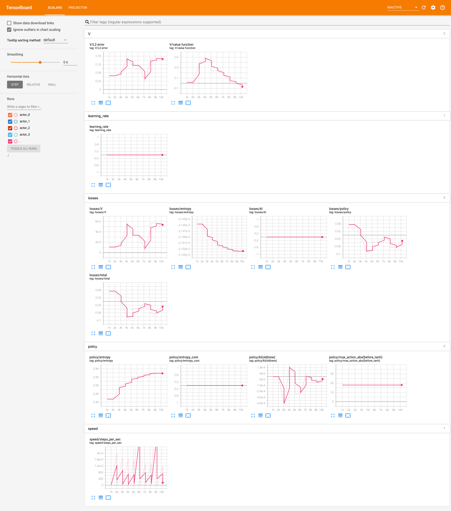</div>

出力されるlog
- V(価値関数)
- learning_rate
- losses
- policy
- speed

さらに欲しい情報  
- 報酬(統計量)
- difficulty
- checkpoints
- ストリーミングで可視化できる？

---
### [2020/10/24]

#### seedrlコードの変更点について
現状特にコミットとかはまだしていない

**NOTE** 
kuto_seed_rlの変更点
- seed_rl/gcp/run.pyのget_py_main関数をadaptiveに書き換えた
- seed_rldocker/Dockerfile.footballのdockerfileでgfootballのバージョンを2.7に変更した
- seed_rl/agents/vtrace/learner.pyのminimize関数の1行目でenvへn_episodesを渡す
```python
n_episodes = info_queue.size()
```
- adaptive_mainにcheckpointsのwrapperを追加  
Wrappの順番の問題でそのままwrappするとerror  
CheckpointRewardWrapperのreward関数のI/Oのtypeを変更することで解決   
 
 checkpointの減衰
<div align="center">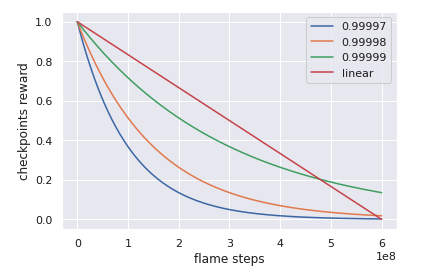</div>


### [2020/10/25]
やりたいこと5点  
- raw return 1.1以上だと２点以上ということになるのでは問題の確認  
→ 3 episodesの平均なので問題はない

- checkpointを追加するとerrorとなっている状況  
→checkpointをwrappするところで固まる  
rainbowでは適用できる  
違いとしてはdifficultywrapperとSMMサイズを変更していること  
```
to be float but double is provided
```  
checkpoint報酬にepsilonをかけたことでfloatの不動小数点が期待される値と違う値になってしまった？
np.float32をcheckpoint_rewardに適用してうまくいった!

- difficulty、checkpoints、報酬の推移のlog化  
learnerのcompute_loss関数内に以下を追加
またenvインスタンスを関数内で使用したいのでcompute_lossの引数にenvを追加
```
logger.log(session, 'difficulty', env.difficulty)
logger.log(session, 'checkpoints_reward', env._checkpoints_reward)
```
tensorboardを確認すると変化していないことを確認
<div align="center">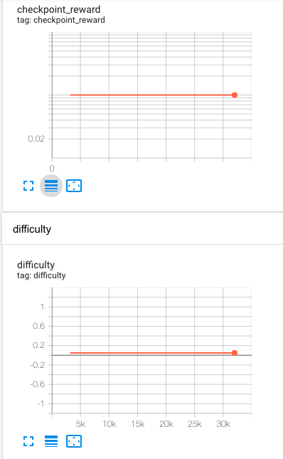</div>
loggerに渡した値が定数扱いとなっている？

- GCP tpuの設定
TPUについて 
https://cloud.google.com/ai-platform/training/docs/using-tpus?hl=ja#tpu-v3-beta

train_football_checkpoints.sh内のconfig.yaml
```
tpuTfVersion: '2.2'
```

### [2020/10/26]
actorのlog
<div align="center">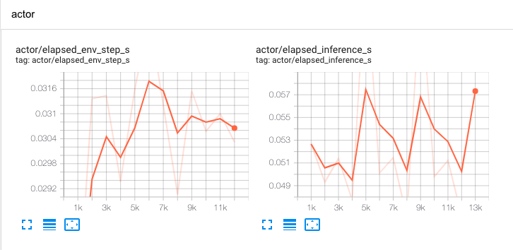</div>

actor側でdifficultyとかcheckpointは取得できる  
tensorboardのlogについて  
https://www.tensorflow.org/api_docs/python/tf/summary

  
GCPを利用する上での整理  
num_actor == num_env  
master == learner == tpu
worker == actor == cpu  

[2020/10/27]

remoteブランチを削除
```
git push --delete origin kuto
```

offsideについて
https://github.com/google-research/football/blob/511e6412808bbc334cc29e78ba01919dd59f7e19/gfootball/env/football_env_test.py
ここでoffsideのtestコードが書かれている
```
o[0]['right_team'][1][0] == 0
```
上記が0以外の時オフサイドとなる？
ただしこれはrawデータなんだけどSMMではoffsideを同判定すればいい？

game_mode
https://github.com/google-research/football/blob/10dae9d7039fc933128d52a92055ae3c76b70075/gfootball/doc/observation.md#observations--actions
6 = e_GameMode_Penalty
envをunwrappedしてgame_modeは取得可能

```
# add custom reward wrapper @kuto
class PenaltyRewardWrapper(gym.RewardWrapper):
  """A wrapper that adds a penalty reward."""

  def __init__(self, env):
    gym.RewardWrapper.__init__(self, env)
    self.penalty_reward = -0.1

  def reward(self, reward):
    reward = [reward]
    observation = self.env.unwrapped._env._observation()
    if observation is None:
      return reward

    assert len(reward) == len(observation)
    game_mode = observation[0]['game_mode']
    # game_mode: 6==penalty
    # https://github.com/google-research/football/blob/master/gfootball/doc/observation.md
    if game_mode == 6:
        reward += self.penalty_reward

    return reward[0]
```


```
masterType: n1-highmem-32
masterConfig:
  imageUri: ${IMAGE_URI}:${CONFIG}
  acceleratorConfig:
    count: 2
    type: NVIDIA_TESLA_P100

```
ここら辺しばらくTPUのバグとり  
しかし解決せず
higeponさんがdiscussionで質問したがTPUは現在はうまく使えなそう?
GPUに切り替える

### [2020/11/2]
やること
- Academyをseedrlで使えるようにする
- offsideのreward
- penaltyが重複する修正

### [2020/11/04]
academyによる部分訓練  
diffenceのcustom scenarioを作成し220M stepsの事前学習済みモデルで追加学習  
大体600 steps/s(2.1Msteps/hour)  
通常のscenarioより早い？

<div align="center">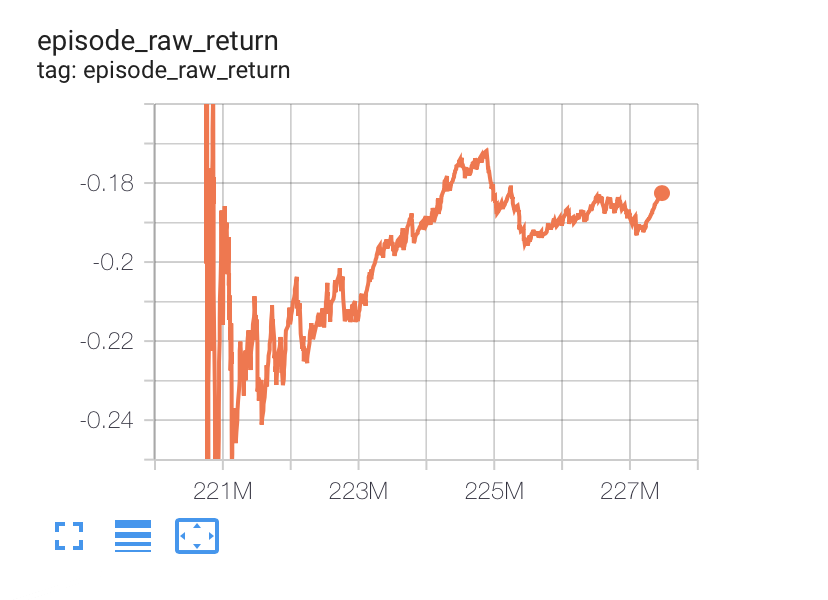</div>
<div align="center">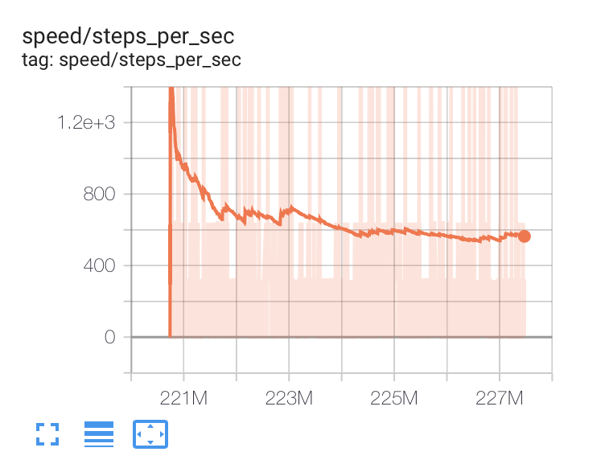</div>

academy agent意外とよくない
score 600くらい
試合を見ても確かに弱くなっている気がする
- 攻めの弱体化(パス)
- 守りはすぐ抜けられてしまう  
  
原因は?  
- stackミスっている？
→ 問題がないことを確認した
- 上書きしたことがまずい？

おそらく違うシナリオを追加学習させたことでagentが以前の内容を忘れてしまった？

### [2020/11/05]
academyが有効に働く条件を知りたい  

academyがうまく機能しない原因
- 局所的な学習を繰り返し行なったことで忘却が起きたため
- フィールド上の人数が実際より極端に少ないため
- カスタムで実装したscenarioの設定がよくなかったため
- checkpointをなくしたため

検証したいこと
- 人数は11人で行う
- 既存のシナリオで行う
- シナリオに摂動を加える
- checkpointは加える


casestudy
- custom counter attack(random switch offence/diffence)
めちゃくちゃ弱くなっている
- シナリオ変えずにそのまま学習させる
学習時間が短いので分からないが試合を見るとよく動いている

- checkpointを加えてカスタムシナリオ11人学習
点を入れられたときはcheckpoint反映されない(←勘違いしていたcheckpointは責める時だけ)
なかなか点数が決まらない,なんか不自然 
動画を見ると動きはそこまで変じゃない
→ scenarioの記述を11vs11に従って書いてみる(first_teamとsecond_teamが入れ替わるやっていることは同じ)

- checkpointのcustom counter cenairo11人(その２)
- プラスの報酬しか出ていない
- ずっと攻めのターンになっている？
→ボールの位置ミスってた

- checkpointのcustom counter cenairo11人(その3)
その１と同じ状況  
これを長い学習時間で様子を見る
続きは次の日

self-playだと倍学習する？


### [2020/10/06]
custom counter attack scenario with checkpointで5-10M追加学習
**条件**
- 交互にチームの向きを変える(攻めと守りが変わる)
- 位置は決定的
- 人数11人
- counter attack scinario
- checkpoint報酬あり

**結果**  
- 以前と比べて変な挙動になっていない
- 攻め方が変わった(以前は中央突破、今回はサイドから攻める)
- 攻め方に多様性が少ない 
- スコアは700と元々より落ちている

### [2020/10/07]
一時的かもしれないが、hardのsubのスコアを比較してると760~950のようにsubによって結構幅がある。  
これは単に学習させたステップ数(つまりagentの性能)の影響か、   
それとも試合の対戦相手やその結果による運要素なのか。
→ 運要素の振れ幅を見るために同一のsubを３回行い振れ幅を確認する    

同じモデルで3つ投稿してみた結果  
- スコアにはざっくり±100の誤差がある
- 運要素に起因したものである
- 対戦を重ねればある程度近いスコアに収束してもいい気がする
- 自信があるモデルは複数subしてスコアを見た方が良さそう
- 対戦序盤のスコア分散σが大きい時は格上の敵に当たりやすく、そこで勝つか負けるかの運次第でスコアに差が生まれている?
- ある程度対戦を重ねるとσは小さくなるので格上の相手と戦うチャンスが少なくなり、同じモデルでもスコアは収束せずそれぞれのスコア帯域に落ち着いている?


custom counter attack scenario with checkpointで5-10M追加学習
**条件**
- 交互にチームの向きを変える(攻めと守りが変わる)
- 位置は確率的
- 人数11人
- counter attack scinario
- checkpoint報酬あり

後ほど以下を加える
- hardとcustomを交互に行う  

GCP計算資源: n1-standard-96 * 2 + P100
計算速度: 3K steps/s (10M steps/h)
計算コスト: $1.46(P100) + $0.0475*192(cpu) = $10.58/h

ざっくり1時間で10Mstepsを1100円くらい

### [2020/10/08]
220M(hard) + 10M (counter attack with checkpoints)
<div align="center">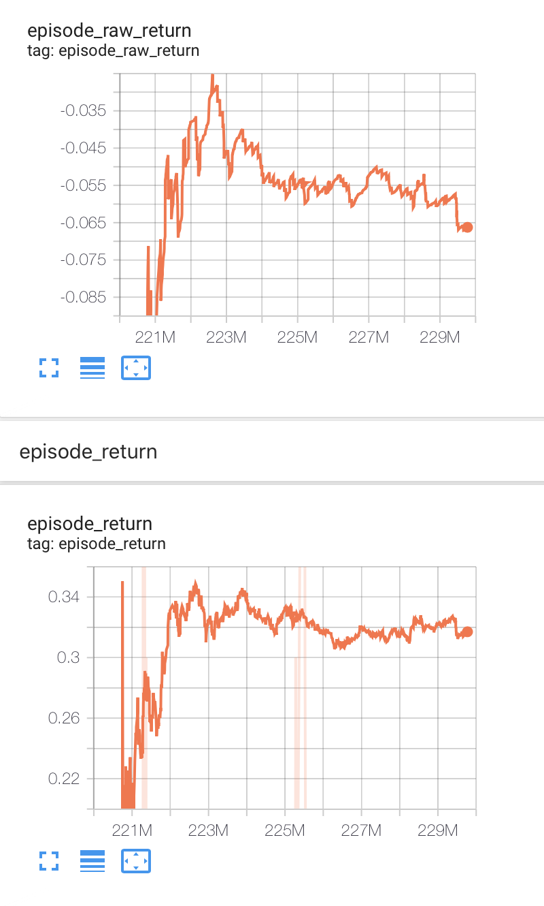</div>
- カスタムシナリオを見ると攻めがよくない印象
- 特徴としては最初はゆっくりドリブルキーパーの直前でシュート
- サイドに進みギリギリでゴールに近づいていく
- 通常の試合は問題ない感じだった
- おそらくcheckpointsの影響で点を決めなくても前に進めば良いと学習している
- 攻めの時だけcheckpointが働くのでepisode returnは0以上になる

対策
- without checkpointで行う(checkpointが急になくなると学習がうまくいかなくなるかも)
- diffenceだけ学習させる、そうすればcheckpointの影響は受けない(ただそれだと一部のシナリオだけを学習してしまい汎化性能落ちる問題あるかも11人にしたので問題はない？)
- 事前学習モデルをcheckpoint減衰させておき、追加学習ではcheckpointをなしとする(これが理想)

これまでのまとめ(220Mの事前学習モデルでシナリオを変えて追加学習)

|シナリオ|対戦相手|checkpoints報酬|選手とボールの初期位置|steps数|スコア(目安)|試合の様子| 
| ---- | ---- | ---- | ---- | ---- | ---- | ---- |
|   counter attack(diffenceのみ)  |  2 vs 4  |  なし  |  決定的  | 7M |  500 | かなり弱くなる |
|  counter attack(攻守を交互に)  |  11 vs 11  |  あり  |  決定的   | 5-10M | 800 | サイドからの攻めを覚えたがパターン化してる  |
|  counter attack(攻守を交互に)   |  11 vs 11  |  あり  |  確率的 |  10M  |  -  | 攻めが弱くなってる(checkpointのせい？)、ドリブルに弱い  |
|  counter attack(攻守を交互に)   |  11 vs 11  |  なし  |  確率的  |  5M?  |  -  |  かなり弱くなる  |
|  counter attack(diffenceのみ)   |  11 vs 11  | あり(diffenceのみなので実質なし)  |  確率的  |  5M?  |  -  |  前のagentに1点差で負ける/攻めが弱くなる  |

整理すると
- checkpointsを完全になくすとかなり弱くなる(めちゃくちゃなパスをしたりするようになる)
- 一つのシナリオだけを行うとそれ以外の部分が弱くなる(diffenceだけやると攻めが弱くなる)
- 通常のシナリオは3000M stepsで最大1.0のcheckpoints rewardが入るが、カスタムシナリオの場合,100steps程度で最大1.0のcheckpoints rewardが手に入る
そのため得点のインセンティブが働きにくく、攻めが弱くなる

現状のモデルを用いてカスタムシナリオでやれることとしたら  
- checkpointsをカスタムシナリオ内で徐々に減衰させながら攻守交互に学習させること
- 通常のシナリオとカスタムシナリオを交互もしくは確率的に切り替えて学習させる

### [2020/11/11]
追加学習の際にcheckpointを減衰させる  
以下条件
|key|value|
| ---- | ---- |
|   checkpoint_num_episodes  | 10K(30Msteps分) |
| scenario | 11_vs_11_hard_stochastic |
|  difficulty  |  1.0  | 
  

GCPでは最初からcheckpointを減衰させる予定なのに対して  
こちらは学習がそれなりに安定してきた220Mから減衰させる  
どちらが良いか検証

### [2020/11/12]
actorは分散学習なのでcheckpointをresetごとに減衰させる場合はその分散環境内で0まで減衰させる必要がある
ex)500Mstepsで分散環境が100こある場合各環境では5Mstepsとなる
  
### [2020/11/13]
difficultyの推移に応じてcheckpoint decayをするように修正
これにより２つの挙動を１つにまとめられるのと負け越しているときにcheckpointを下げるということを避けることができる  

checkpointを追加するとエラー
```
tensorflow.python.framework.errors_impl.InvalidArgumentError: Expects arg[2] to be float but double is provided 
```
解決
np.float32で部分的に囲むのではなく変数に渡す値全体を囲む必要があった


### [2020/11/14]
checkpointのけた数が間違っていた
→修正し再度実行  
    
difficultyの伸びが遅い問題発生
actorを分散させているので1actorあたりのエピソード数が少なくなってしまうのが原因
対策として
- ３試合平均1.1以上→１試合1以上
- difficulty更新幅0.001→0.05
- checkpoint更新幅 0.00011 → 0.0053
として早く推移するようにした

### [2020/11/15]
100Msteps時点でdifficulty=1.0に到達  
saved_modelを落としてsubmit  

提出エラーが起きたと思われる原因
- downloadしたときはassetsがない  
- variables内のファイル名に余分な部分がある
- localで/kaggle_simlations/agent/フォルダを作成せず提出した？
↓
- assetsを手動で追加
- variables内のファイル名を通常に合わせる
- colabで実行
これでとりあえず実行できた。
subしてないがcolab

```
 
```


4Msteps-diff/off 弱い
少量でもcheckpointが必要？

### [2020/11/15]
500M 終了
<div align="center">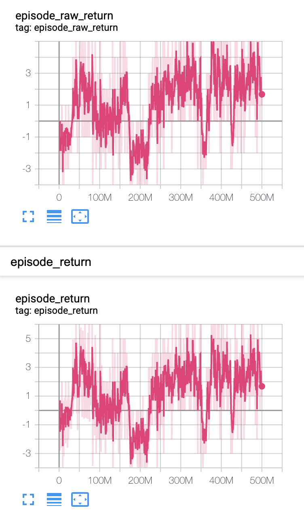</div>
<div align="center">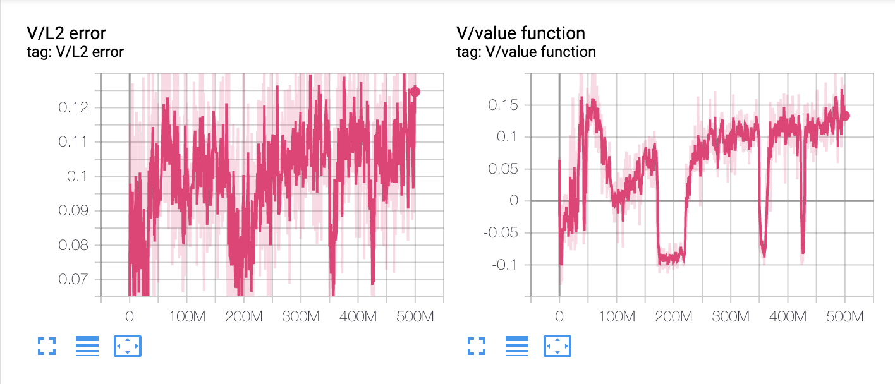</div>
<div align="center">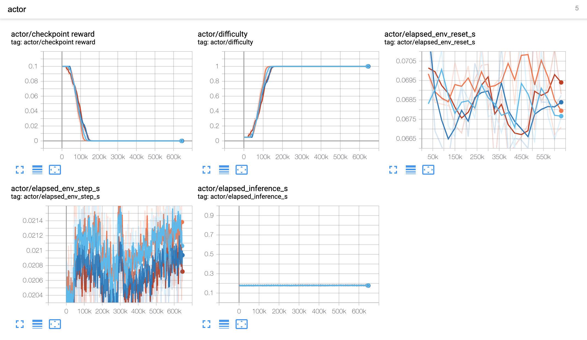</div>
<div align="center">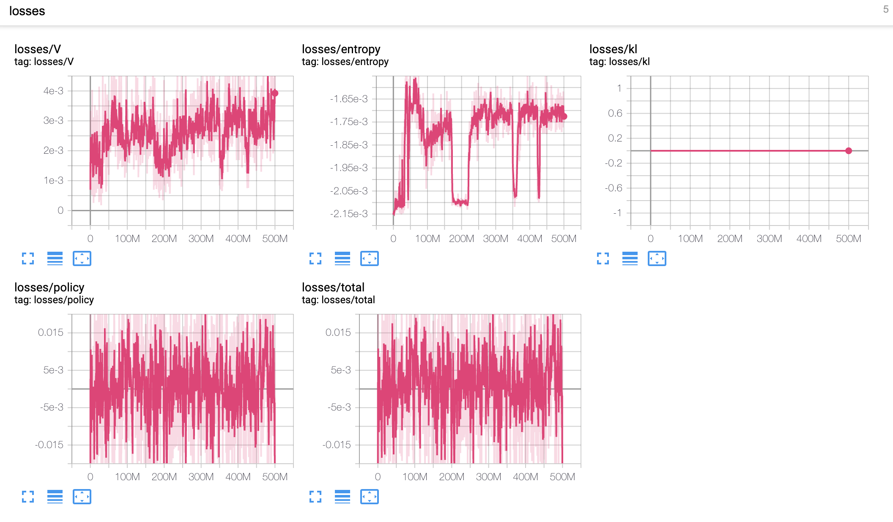</div>
<div align="center">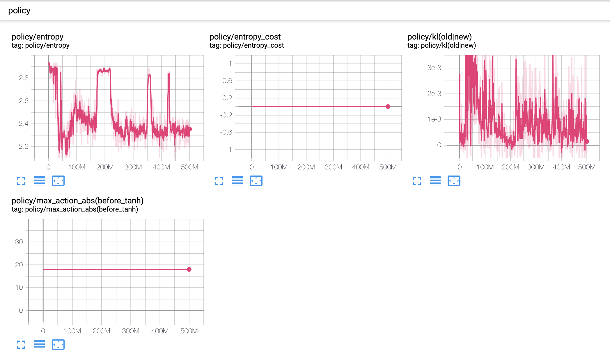</div>
<div align="center">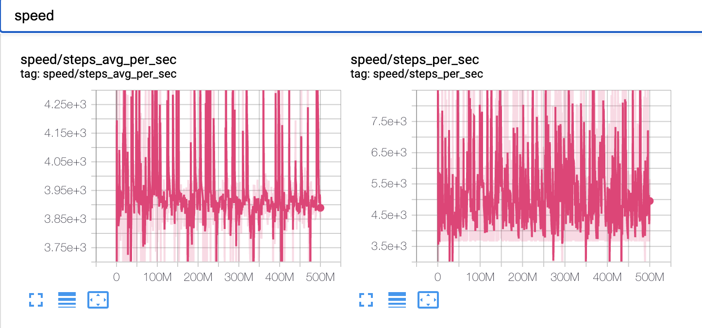</div>

LB score 700~900
raw_returnの割りにscore上がらない
### [2020/11/15]
追加で100M  
右肩上がりでraw_return=2まできた
scoreは低いまま  

### [2020/11/17]
### 900M
hardに過学習していないかを検証  
hardとの対戦(200Mくらいからずっとhard)

<div align="center">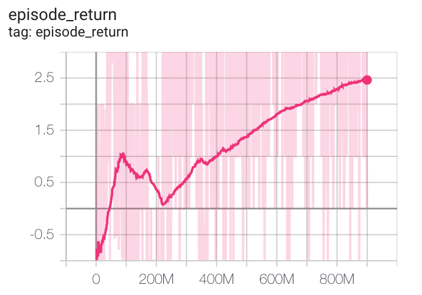</div>
公開botとの対戦結果（20試合分）
<div align="center">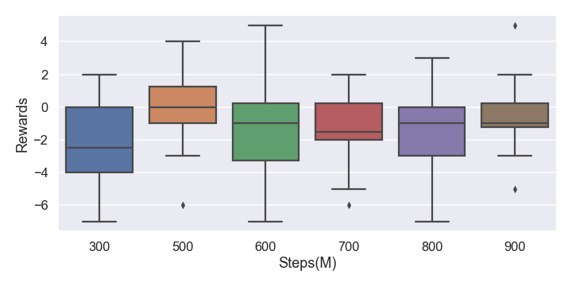</div>
- 300Mからhardに対しては強くなっているがbotに対してはあまり変わらない
- 対botで学習を進めていく必要あり  

最高スコアのkernelのbotを学習に混ぜる  
900M~1200M  

### [2020/11/25]
1285Mまできた  
localでは対botに勝ち越したがLB  


### [2020/11/27]
### 1300M 
<div align="center">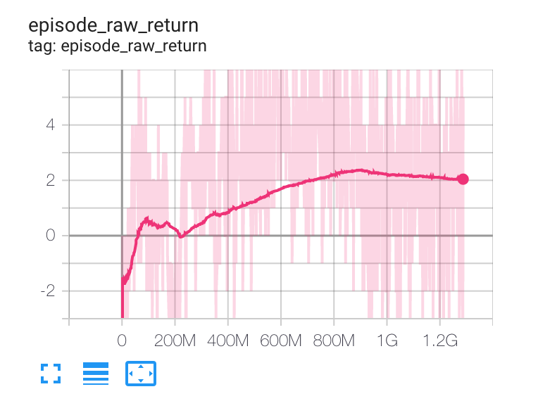</div>

localの試合対戦ではhardにもbotにも勝利しているがLB scoreが下がっている  
他の系統のbotに負けている?    
以下のRF botと対戦させた結果   
https://www.kaggle.com/mlconsult/1149-ish-bot-rl-approximation   
余裕負け: vs random forest   
Totals 22:40 (2勝7敗1引き分け)   

このbotも含めて学習する必要がある  
他にhigh scoreのkernelはない？  
以下が900台のkernel  
https://www.kaggle.com/david1013/tunable-baseline-bot   
our:enermy = 44:37  
WIN:9 LOSE:7 TIE: 4  

https://www.kaggle.com/tomkelly0/lightgbm-10mins-940  
未検証

https://www.kaggle.com/illidan7/marauding-wingers-score-1041-1  
our:enermy = 32:35  
WIN:7 LOSE:7 TIE: 6  

互角な感じ
ひとまずこいつらは置いておく
randomforest botを追加して50Msteps実行　

### 1350M  
<div align="center">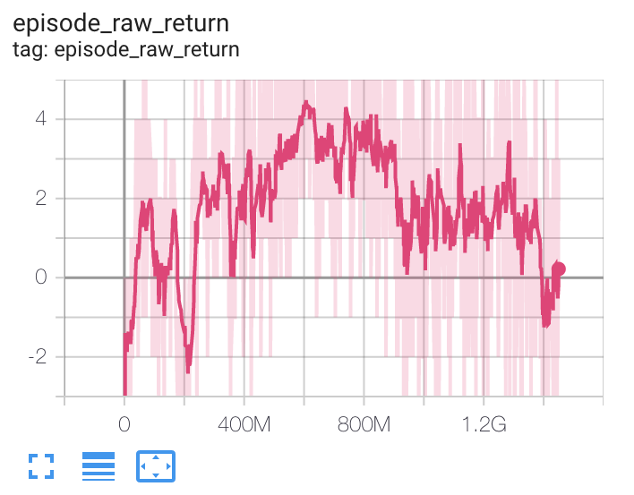</div>
RF-botを追加したことでscore落ちた(想定通りではある)  

### [2020/11/28]

bucket内の対象のディレクトリをダウンロード
```
gsutil cp -r gs://oceanic-hook-23~/SEED_hard_plus_bot_1500M/ ./
```
### 1550M  
hard:memory bot:rf-bot=1:1:5の比で学習
右肩上がり

<div align="center">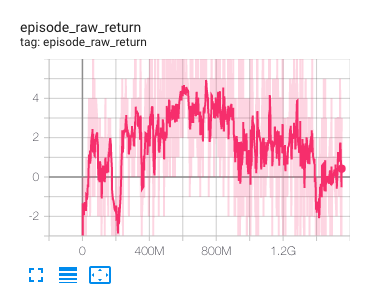</div>


20試合のlocalの結果
| 敵 | スコア | 勝敗 |
| --- | --- | --- |
| hard | 38:27 | 10勝5敗5引き分け |
| memory-bot | 46:28 | 13勝3敗4引き分け |
| RF-bot | 50:56 | 6勝9敗5引き分け |

hard, memory-botには勝ち越していてRF-botには負けている？  
memory-botの方が強いのでもう少しリソースをmemory-botにさくべき？  


### 1600M
hard:memory bot:rf-bot=1:2:5の比で学習
<div align="center">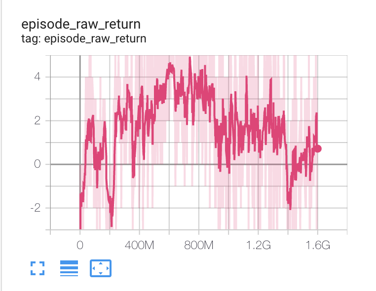</div>
右肩上がり


20試合のlocalの結果
| 敵 | スコア | 勝敗 |
| --- | --- | --- |
| hard | 40:25 | 13勝3敗4引き分け |
| memory-bot | 67:36 | 14勝3敗3引き分け |
| RF-bot | 66:48 | 12勝7敗1引き分け |


### 1650M
20試合のlocalの結果
<div align="center">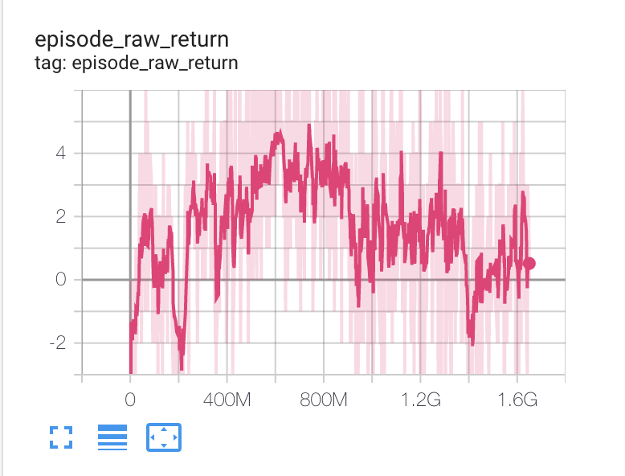</div>
<div align="center">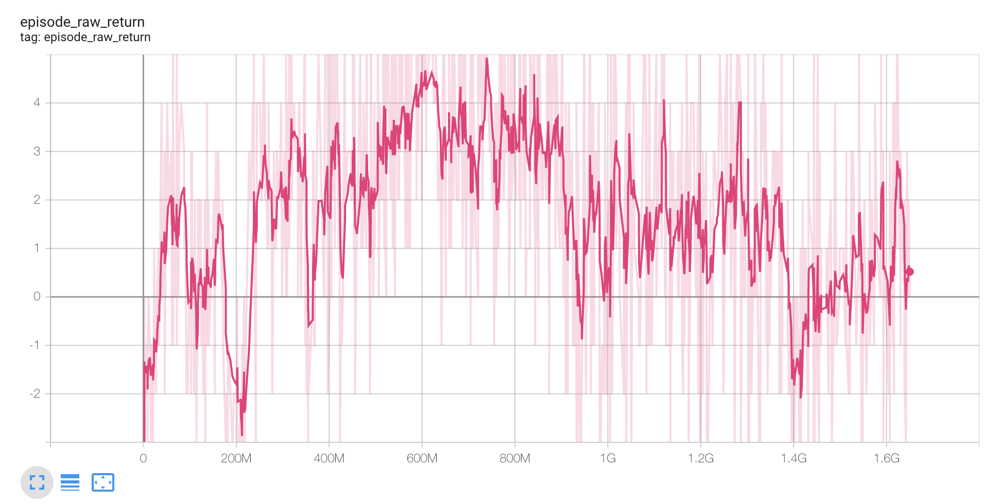</div>

40試合
| 敵 | スコア | 勝敗 |
| --- | --- | --- |
| hard | 73:56 | 20勝7敗13引き分け |
| memory-bot | 131:76 | 28勝6敗6引き分け |
| RF-bot | 111:102 | 18勝16敗6引き分け |


### [2020/11/30] 最終日

上記の図を見るとreturnの波形は振れ幅がある  
上peakのときのモデルは強いのでは？
stepsを刻んで1620M付近でpeakを探索する  
### 1620M
(10試合)
| 敵 | スコア | 勝敗 |
| --- | --- | --- |
| hard | 30:14 | 6勝0敗4引き分け |
| memory-bot | 27:16 | 6勝3敗1引き分け |
| RF-bot | 40:27 | 5勝5敗0引き分け |


### 1623M 
(20試合)
| 敵 | スコア | 勝敗 |
| --- | --- | --- |
| hard | 66:24 | 16勝1敗3引き分け |
| memory-bot | 74:38 | 13勝5敗2引き分け |
| RF-bot | 70:51 | 13勝5敗2引き分け |

### 1624M
(20試合)
| 敵 | スコア | 勝敗 |
| --- | --- | --- |
| hard | 48:27 | 14勝4敗2引き分け |
| memory-bot | 68:42 | 14勝3敗3引き分け |
| RF-bot | 57:34 | 14勝3敗3引き分け |

Although the score and ranking has not decided I'd like to share our kutopon solution.

First, thanks for everyone involved in organizing such a great competition. 
And also thanks my teammate @higepon .

Our approach is Reinforcement Learning by using [SEED RL](https://github.com/google-research/seed_rl).

## summary
- 1625M steps(about 541,666 games)
- adaptive difficulty & checkpoint reward decay
- train with multiple enemies(hard builtin AI & [memory pattern bot](https://www.kaggle.com/yegorbiryukov/gfootball-with-memory-patterns) & [random forest bot](https://www.kaggle.com/mlconsult/1149-ish-bot-rl-approximation) 

Thanks for Yegor Biryukov(@) and Ken Miller( @mlconsult )  to share your good notebook!

## steps

### 0~160M 
We trained our agent with adaptive difficulty & checkpoint decay.
builtin AI which was prepared in Gfootball environment can change the difficulty(range 0~1/easy:0.05/hard:0.95). And [this post](https://sites.google.com/view/rl-football/singleagent-team) say that CHECKPOINT reward is effective in the early stages but not effective well in further stages of training.
So We started to train with difficulty=0.05 and checkpoint reward=0.1 as the initial values and if the average rewards was above 1, we decided to raise the difficulty level by 0.05 and lower the checkpoint reward by 0.0053 in learner.
Our agent reached a difficulty of 1.0 and CHECKPOINT reward of 0.0 in 160M steps.

LB score is 700.

### 160M-900M
resume training with builtin AI bot(difficulty=1.0).
not improve the LB score although the reward return increased in training.

LB score is 800-900.

### 900M-1400M
playing against builtin AI bot and memory pattern bot.
Training rate is builtin AI : memory = 3:5(or 1:3)

LB score is 900-1000.

### 1400-1625M
playing against builtin AI bot and memory pattern bot and random forest bot.
Training rate is builtin AI : memory : random forest = 1:1:6(or 1:2:5)

LB score is 1000-1200.


validation game in final agent in 20 games.
| Opponent | Total score | Total results |
| --- | --- | --- |
| builtin AI | 48:27 | 14WIN 4LOSE 2TIE |
| memory pattern bot | 68:42 | 14WIN 3LOSE 3TIE |
| random forest bot | 57:34 | 14WIN 3LOSE 3TIE |

## not work
- training with custom scenario
- ensemble agent (decide the action by voting multiple RL agent)