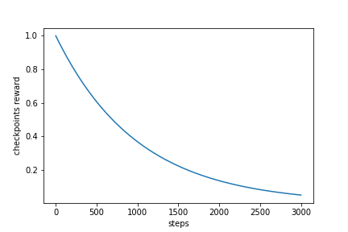

# Google Research Football with Manchester City F.C.


competition link is [here](https://www.kaggle.com/c/google-football)

---

## Rules
### 基本ルール
11人チームの1人のプレイヤーを操作可能  
ルールは公式のサッカーとほとんど同じ(オフサイド、イエローカード、レッドカード)  
しかし僅かながら違いがある

- ゲームは2つのハーフ、45分（1500 steps）ずつで構成。(つまり1step=1.8s)
各ハーフの開始時のキックオフは別のチームで行われるが、サイドの入れ替えはなし（ゲームは完全に左右対称です）。
- 各エージェントは、チーム内の1人の選手をコントロール。コントロールされたプレイヤーは、**常にボールを持っているプレイヤー、または守備時にボールに近いプレイヤーとなる。**
- ゲーム中にチームがサイドを入れ替えることはない。左右のサイドはランダムに割り当てられる。
- エージェント実装の便宜上，提供されるオブザベーションは，**エージェントが左チームをコントロールしているかのように常に表示される**．
- 環境は、観察とアクションの両方に適切な変換を適用する。ゲームエンジンは完全に対称的であるため、左右の入れ替えはゲームに影響を与えない。
- 非カップスコアリングルールが適用され、より多くのゴールを決めたチームが勝ち。
- チームの選手数が7人以下になった場合、ウォークオーバーは適用されません。
- 交代選手は存在しない。
- 延長戦は適用されない。

### オブザベーションと行動
各ターンで、エージェントは現在のスコア、全プレイヤーの位置、プレイヤーのスピード、疲労度を含むゲームの完全な状態を表すオブザベーションを受け取る。
オブザベーションの詳細なフォーマットは[こちら](https://github.com/google-research/football/blob/master/gfootball/doc/observation.md#raw-observations)  
各ターンで、エージェントはデフォルトのアクションセットから19のアクション（0から18までの番号）のうちの1つを生成する。
アクションセットの外のアクションを返すとエージェントの損失となる。[(参考)](https://github.com/google-research/football/blob/master/gfootball/doc/observation.md#default-action-set)


### ゲーム終了
3000ターン後、またはエージェントのどちらかがエラーを起こした場合(タイムアウト、例外が投げられた場合、無効なアクションが返された場合)にゲーム終了。
エラーを起こしたエージェントが負け、他のエージェントが勝つ。エラーがなかった場合は、より多くのゴールを獲得したチームが勝ち。
ランキングは評価ルールに従って更新。

---

## citation 
[1][Google Research Footballに関する論文](http://arxiv.org/abs/1907.11180)  
[2][SEED RL](https://arxiv.org/abs/1910.06591)
    強化学習手法のベースラインとしてはじめに与えられている手法。
    Google Research FootballでSOTA

[3]PFRL(PyTorchの強化学習フレームワーク)
[GitHub](https://github.com/pfnet/pfrl), [docment](http://pfrl.readthedocs.io/en/latest/index.html)  
[4][公式紹介のブログ記事](https://sites.google.com/view/rl-football/singleagent-team)

---

## log

### [2020/09/30]
discussionにGRF論文の内容を投稿　
https://www.kaggle.com/c/google-football/discussion/187657

[公式からのdiscussion](https://www.kaggle.com/c/google-football/discussion/187381)より
- validation episodeが75分ととても長いこと
- windows上では環境がうまく動かないこと
- ごくたまにvalidation episodeが終了しないことがある
- 新しいepisodesが処理されない

アイデア　CNNに入力する際に次元数を増やしSMMをpixel入力に重ねて入力

やったこと
- googlefootのAPIを触る
- ２つ目のSEED RLをsubして強化学習の様子を見る
- ファイルのoutput形式がtz形式


### [2020/10/01]
SEED RL[2]の論文を読んだ。
<div align="center"></div>

- TPUによって計算コストをかなり抑えられる一方p100だとあまり向上しない
- 計算効率は高いのでSEED RLをベースに学習アルゴリズムや報酬をを変更する方針で進める
- TPU v3を32コア使うとmax(1試行？)がscoring rewardで4.76(4点相当), checkpointでが7.66とかなり大きい.
しかし上記は計算機がないので流石に実現不可(4億フレーム学習と書いている、意味がわからない)
- フレーム数を極端に大きく取らない限りSMM(super mini map)のimage sizeを大きくしても変化はないみたい
- SEED RLのSMM defaultで$345(4万くらい?)

ブログ記事[4]を読んだ
本ゲーム環境は３種類の表現がある
- Pixels表現は自然に見えるが、ノイズが多く、表現サイズが膨大なために失敗
- Super MiniMapとSimple115は同等の表現であるが、Simple115の方が環境に関するデータ量が多い。
- 論文では, Super MiniMap > Floats(Simple115)
- この結果を直感的ではないものと考え,"Floats "表現を使用する強力なエージェントの作成を試みる。

<div align="center"></div>
easy modeはうまくいっているが,hard modeはおもわしくない。easy modeのみではオーバーフィットしてしまう(hard modeに対応できない)  

そこで**平均報酬が選択されたしきい値に達すると、次のラウンドから難易度をイプシロン増加させる**
<div align="center"></div>

- 良い効果が出ている
- ただし800Mステップに15日かかる  
- 計算効率を改善するために32 CPUs(instead of 16), 64 parallel environments(instead of 16) 
- **CHECKPOINT報酬は初めに適用させゴールが決まるようになったら減衰させ0に近づけていくのがおすすめ**

### [2020/10/02]
- 学習に時間を要するのと結果の分散が大きいことからRLアプローチは不利ではある
- self play を行うためにはGRFのレポジトリ内のexample PPOを参照する
number_of_right_players_agent_controls=1にする

- 未学習のRL-agentを見るとファールやオフサイドなどのミスが多すぎる
- これらにマイナス報酬を与える?しかし他の実装では報酬はCHECKPOINTとSCORINGのみなのであまり有効ではない？
- 前半だけ与える？

方針
- easyで勝てるくらいのベースとなるagentを作成する
- その際はCHECKPOINTとFOUL報酬を与える

やったこと
- SEED RLのflame数を5Mに設定しCPU, GPU, TPUで実行時間を比較する
- ちなみに論文実装は500M(4000M)
- 学習結果を保存し9hで引き続き学習する

- シミュレータでの学習と自己学習はどちらがよい?
self-learning
事前に対戦相手の戦略に関する情報が得られている必要はなく，ゼロから学習が可能である  
また，徐々に強いエージェントを相手に学習するようになるため，最初から強いエージェントを相手にするよりも学習がスムーズに進みやすい


### [2020/10/03]
CPU times: Wall time: 3h 57min 48s  Total 5.7h


攻撃時と守備時で方策を変える
episodeは何単位？

### [2020/10/03]  
- PFRLを使ってrainbow DQNを実装中
- 入力のshapeが合っておらずerror
- まずはbaselineを作りたい
- $2000のGCPクレジットは貰えなかったが来週100名に$1000クレジットを配布する
- PFRLでnotebookを今週中に投稿したい
- 内容はrainbow-DQNをPFRLで実装しself-playで訓練して重みを保存後submitまで


### [2020/10/04]  
- PFRLの実装例を洗う
- 基本部分env, NN, agentは今日中に作成 
- Self-playの方法について学ぶ

### [2020/10/05]  
アイデア  
- 新たな報酬を加える
候補1. ボール支配率
候補2. ファール, オフサイドにはマイナス報酬

- reward関数の場所
football/gfootball/env/wrappers.py
SingleAgentRewardWrapper
CheckpointRewardWrapper

checkpointの概要

以下の条件以外はrewardを得る
- ball_own_teamというkeyが観測状態中にない
- 観測された状態のball_own_team＝0
- ball_own_playerというkeyが観測状態にない
- 観測された状態のball_own_playerがactiveでない

- Tensorflow kerasでモデルを読み込んだ後summary()が見れない
AttributeError: '_UserObject' object has no attribute 'summary'

TPU
CPU times: user 10.7 s, sys: 2.14 s, total: 12.9 s
Wall time: 6min

CPU
CPU times: user 7.34 s, sys: 1.08 s, total: 8.42 s
Wall time: 5min 13s
計算時間変わらない？なぜ？

### [2020/10/05]  
PFRLでrainbowを実装
とりあえずtrainまで進めることができた
Wrapperを使うことでenvに対して前処理を行う
450000 flameで学習→9hを超えてしまった

### [2020/10/06]  
評価のパートの理解と結果の可視化を行いたい
報酬の推移グラフ
GPUの使い方
報酬追加

QとlossがNanになっているのが気になる

### [2020/10/07]  
Rainbow-PFRLでGPUを使えるようになった
モデルの読み込みがうまくいっているかが不明
(load後の重みに変化がない)

アイデア
- FloatとSMMを組み合わせた情報で学習
- Pixelを世界モデルで学習

### [2020/10/07]    
- Rainbowのn_atomsは分布強化学習の元論文を読むことで解決
Rainbow 9000 step(CPU)

[CPU]
CPU times: user 11min 21s, sys: 25.7 s, total: 11min 46s
Wall time: 5min 53s

[GPU]
CPU times: user 4min 12s, sys: 854 ms, total: 4min 13s
Wall time: 4min 15s

多少のブレ(+-1 min)はあるにしてもGPUの方が早そう

Errorに悩まされている
Envにwrapperを使ってobsの変換を行なっているんだけど
変換がうまくいかない
画像サイズとかは変えずにshapeのみPyTorchに合うように変換する


### [2020/10/12]   
`create_environment`を見た
Custom rewardはcreate_environmentからではなく、新しいwrapper関数を作るだけで良い
rainbowを1M step GPUで回す

### [2020/10/13]   
Failed. Exited with code 137.
Replay buffが大きすぎることによるメモリリークと思われる
CPUの場合は315000 step(8.96h)
GPUの場合は393000 step(3.6h)

Replay buffe 10 **6 → 10**5に変更

### [2020/10/14]   
Replay bufferを減らしたことでリークエラーは消えた
Agentのreturnにnumpyを使っていたことが原因でenv.runがうまくいっていなかったこれを解決
Timeouterrorが起きることによるエラー
→DeadlineExceeded()
おそらく行動選択に時間がかかってしまっていることに対するエラー
[GFootball: Rainbow-DQN [PFRL]](https://www.kaggle.com/kuto0633/gfootball-rainbow-dqn-pfrl)を公開

### [2020/10/15]  
pfrlがagent関数ないで読み込めていないのが原因でsubがうまくいかない
<div align="center"></div>
これが確か1M stepで学習したもの
更新のタイミングでlossが下がるのでこのように規則正しい下がり方をしている？
rewardはあまり上がらない(整数しか撮っていないのだがcheckpointは使われている？)


`stickytape`を使用することでサブミット問題を解決
しかしpipでインストールしたpfrlが消せなくて困っている

[2020/10/17]
create_envirnmentを確認したところ
```
if 'checkpoints' in rewards.split(','):
    env = wrappers.CheckpointRewardWrapper(env)
```
環境を作成する際に
rewards = scoring, checkpoints,
カンマの間に空白があるとダメ  
正しくは  `rewards = scoring,checkpoints`  
上記内容をdiscussionに投稿
  
  
報酬の減衰をどうするか問題
<div align="center"></div>

```
gamma = 0.999999
num_steps = 10000000  # 10M steps
reward = 1
```

<div align="center"></div>

```
gamma = 0.999
num_episodes = 3000
reward = 1
```

### [2020/10/18]

```
could not find proposed file
```
おそらく保存場所の問題  
`/kaggle/working/` 直下にpyファイルを置いたら解決  

runtime error
pfrlのmoduleの読み込みに時間がかかる
60s与えられているのでは？
```
[[{"duration": 10.403563, "stdout": "", "stderr": ""}]]
```

model作成なし
weightなし
モデルによるactionの出力もなし
でいける


### [2020/10/19]
weightを圧縮せずに
同じディレクトリにおいてtar.gz圧縮 or モデル読み込みなしでsubmission.pyにすると以下のエラーが出る
```
[[{"duration": 0.002522, "stdout": "", "stderr": "Traceback (most recent call last):\n  File \"/opt/conda/lib/python3.7/site-packages/kaggle_environments/agent.py\", line 43, in get_last_callable\n    code_object = compile(raw, \"<string>\", \"exec\")\n  File \"<string>\", line 1\n    /kaggle_simulations/agent/main.py\n    ^\nSyntaxError: invalid syntax\n\nDuring handling of the above exception, another exception occurred:\n\nTraceback (most recent call last):\n  File \"/opt/conda/lib/python3.7/site-packages/kaggle_environments/agent.py\", line 159, in act\n    action = self.agent(*args)\n  File \"/opt/conda/lib/python3.7/site-packages/kaggle_environments/agent.py\", line 116, in callable_agent\n    agent = get_last_callable(raw) or raw\n  File \"/opt/conda/lib/python3.7/site-packages/kaggle_environments/agent.py\", line 58, in get_last_callable\n    raise InvalidArgument(\"Invalid raw Python: \" + repr(e))\nkaggle_environments.errors.InvalidArgument: Invalid raw Python: SyntaxError('invalid syntax', ('<string>', 1, 1, '/kaggle_simulations/agent/main.py\\n'))\n"}]]
```
↑↓path通してこのエラーは回避した

```
[
```
pfrlを読み込めていることを確認
```
[[{"duration": 9.90701, "stdout": "{'n_actions': 19, 'n_input_channels': 4, 'activation': <built-in method relu of type object at 0x7f01996d0000>, 'n_atoms': 51, 'training': True, '_parameters': OrderedDict(), '_buffers': OrderedDict(), '_non_persistent_buffers_set': set(), '_backward_hooks': OrderedDict(), '_forward_hooks': OrderedDict(), '_forward_pre_hooks': OrderedDict(), '_state_dict_hooks': OrderedDict(), '_load_state_dict_pre_hooks': OrderedDict(), '_modules': OrderedDict([('conv_layers', ModuleList(\n  (0): Conv2d(4, 32, kernel_size=(8, 8), stride=(4, 4))\n  (1): Conv2d(32, 64, kernel_size=(4, 4), stride=(2, 2))\n  (2): Conv2d(64, 64, kernel_size=(3, 3), stride=(1, 1))\n)), ('main_stream', FactorizedNoisyLinear(\n  (mu): Linear(in_features=3136, out_features=1024, bias=True)\n  (sigma): Linear(in_features=3136, out_features=1024, bias=True)\n)), ('a_stream', FactorizedNoisyLinear(\n  (mu): Linear(in_features=512, out_features=969, bias=True)\n  (sigma): Linear(in_features=512, out_features=969, bias=True)\n)), ('v_stream', FactorizedNoisyLinear(", "stderr": ""}]]
```
modelにactionを渡せてはいるが時間の問題？

modelからactionなしであればいける　なぜ
原因となっているのは`action = model(obs)`
初めのモデルへの入力がボトルネックになっている可能性があるので
agent関数の外で一度ダミーのobsをmodelに入力しておく
上記でもエラー

seedrlの取り組みを真似してみる
あまり真似するところがない
```
[[{"duration": 10.403563, "stdout": "", "stderr": ""}]]
```

SEED RL Default TPU v3 2coreでやってみる
1sあたり18K stepsは早すぎる
easyからdifficultに徐々に変更

3つのモデルで行う
- Rainbow
- PPO2
- seedRL(v-trace)

離散的に難易度を変えてその後にできたら動的にコードから変える

### [2020/10/20]  
閾値を決めてその値を3試合分の評価スコアが超えたら難易度を上げる
football/gfootball/scenarios/11_vs_11_easy_stochastic.pyの中身
```python
def build_scenario(builder):
  builder.config().game_duration = 3000
  builder.config().right_team_difficulty = 0.05
```
right_team_difficultyを動的に変えたい  
stepで変えるかscoreで変えるか  
どこで変えれば良い？  

`football/gfootball/env/config.py`  
ここにnew scenarioという関数がある使えそう  
configがどこで使われているかを調べる使われているかを調べる

`football/gfootball/env/scenario_builder.py`  
ここのScenarioクラスでconfigが使われている

ひとまず以下のファイルを作成し環境として使用することで手動ではあるが難易度の変更が可能
可能であればコードで変更したいが暫定的にはこれで難易度調整を行う

```python
%%writefile football/gfootball/scenarios/11_vs_11_custom_stochastic.py 
from . import *

def build_scenario(builder):
  builder.config().game_duration = 3000
  builder.config().right_team_difficulty = 0.2  # <-難易度を変更
  builder.config().deterministic = False
  if builder.EpisodeNumber() % 2 == 0:
    first_team = Team.e_Left
    second_team = Team.e_Right
  else:
    first_team = Team.e_Right
    second_team = Team.e_Left
  builder.SetTeam(first_team)
  builder.AddPlayer(-1.000000, 0.000000, e_PlayerRole_GK)
  builder.AddPlayer(0.000000,  0.020000, e_PlayerRole_RM)
  builder.AddPlayer(0.000000, -0.020000, e_PlayerRole_CF)
  builder.AddPlayer(-0.422000, -0.19576, e_PlayerRole_LB)
  builder.AddPlayer(-0.500000, -0.06356, e_PlayerRole_CB)
  builder.AddPlayer(-0.500000, 0.063559, e_PlayerRole_CB)
  builder.AddPlayer(-0.422000, 0.195760, e_PlayerRole_RB)
  builder.AddPlayer(-0.184212, -0.10568, e_PlayerRole_CM)
  builder.AddPlayer(-0.267574, 0.000000, e_PlayerRole_CM)
  builder.AddPlayer(-0.184212, 0.105680, e_PlayerRole_CM)
  builder.AddPlayer(-0.010000, -0.21610, e_PlayerRole_LM)
  builder.SetTeam(second_team)
  builder.AddPlayer(-1.000000, 0.000000, e_PlayerRole_GK)
  builder.AddPlayer(-0.050000, 0.000000, e_PlayerRole_RM)
  builder.AddPlayer(-0.010000, 0.216102, e_PlayerRole_CF)
  builder.AddPlayer(-0.422000, -0.19576, e_PlayerRole_LB)
  builder.AddPlayer(-0.500000, -0.06356, e_PlayerRole_CB)
  builder.AddPlayer(-0.500000, 0.063559, e_PlayerRole_CB)
  builder.AddPlayer(-0.422000, 0.195760, e_PlayerRole_RB)
  builder.AddPlayer(-0.184212, -0.10568, e_PlayerRole_CM)
  builder.AddPlayer(-0.267574, 0.000000, e_PlayerRole_CM)
  builder.AddPlayer(-0.184212, 0.105680, e_PlayerRole_CM)
  builder.AddPlayer(-0.010000, -0.21610, e_PlayerRole_LM)

```

east modeで1M steps学習した結果  
若干右肩上がり
<div align="center"></div>

### [2020/10/21]

custom_scenarioをやると以下のエラー
他のファイルもいじらないとダメぽい
```
ERROR:absl:Loading scenario "11_vs_11_custom_stochastic" failed
ERROR:absl:No module named 'gfootball.scenarios.11_vs_11_custom_stochastic'
---------------------------------------------------------------------------
ModuleNotFoundError                       Traceback (most recent call last)
/usr/local/lib/python3.6/dist-packages/gfootball/env/scenario_builder.py in __init__(self, config)
     56     try:
---> 57       scenario = importlib.import_module('gfootball.scenarios.{}'.format(config['level']))
     58     except ImportError as e:

9 frames
ModuleNotFoundError: No module named 'gfootball.scenarios.11_vs_11_custom_stochastic'

During handling of the above exception, another exception occurred:

NameError                                 Traceback (most recent call last)
/usr/local/lib/python3.6/dist-packages/gfootball/env/scenario_builder.py in __init__(self, config)
     59       logging.error('Loading scenario "%s" failed' % config['level'])
     60       logging.error(e)
---> 61       exit(1)
     62     scenario.build_scenario(self)
     63     self.SetTeam(libgame.e_Team.e_Left)

NameError: name 'exit' is not defined
```
ひとまず既存のファイルを上書きする形で対処する
難易度=0.2で1M~2M stepsを行う

難易度を変更するのを繰り返すことで様々な敵と対戦することになり汎化性能が上がりそう
易→難にすることで学習が進みやすそう(self-playやGANの考えに近い)

sheme
1M stepごとに難易度を0.1ずつ上げる  
0.5, 2, 3, ...... 8, 9.5  
difficult(0.95)は2M steps  
これを１セットとして学習  

difficulty=0.2の結果(700Kstepsくらいで落ちた)
<div align="center"></div>

checkpointrewardを簡易的に追加できないかと思って試行錯誤している  
wrapperをcustomして後付けしたいができていない    
  
やったこと  
checkpointsはなしでenv create  
checkpoint wrapperないのstepを修正したがunwrappedしたときにその他のwrapperも削除されてしまいうまくいかない  
ただしsteps数やconfigは取れるかも  
env.unwrapped._env. ~step?

サブ解決したかも！

```
action = actions.greedy_actions.numpy())
```
上を下に変更する
```
action = int(actions.greedy_actions.numpy()[0])
```
agent関数内でactionを返すときにtensor→numpy→listとしていた  
そのときactionにはnp.asarray([1])が入っていて
list(action)としていたので[[1]]となっていた？  
printの標準出力では[0]のように問題なく出力されていた

以下は2M stepsのrainbowの結果  
0-1M steps (difficulty=0.05(easy))
<div align="center"></div>
1-2M steps (difficulty=0.2)
<div align="center"></div>
  
Rainbow修正版をnotebookに公開  
[GFootball: Modified-Rainbow-DQN [PFRL]](https://www.kaggle.com/kuto0633/gfootball-modified-rainbow-dqn-pfrl)


### [2020/10/22]  
GCPでseedrlを回す準備
<div align="center"></div>
<div align="center"></div>

**環境設定**  
- TPU 2cores
- CPU 416cores
- Batch 128
- SMM size default

**時間**
- 1s - 18K steps  
- 1h - 60M steps(2K episodes)

**コスト**  
- $0.0475 * 416 = $20/h  
- $1.0 * 2 = $2/h  
- total 1hあたり$22

ひとまず1h(60M steps)で試してみる

## [2020/10/22]
ブログ記事に従いeasy modeから記載のパラメータでadaptive trainingを60M steps行う
ブログの記事を参照するとおそらくscore 1くらいで終了するのでは？  
その時にadaptive difficultyがどの値かも記録する
<div align="center"></div>

logとして欲しい情報の整理
- 報酬推移
- adaptive difficultyの推移
- lossの推移

---
**AI platform TPU 8coreしか使えない模様**

**環境設定**  
- TPU 8cores
- CPU 1664cores
- Batch 160
- SMM size default

**時間**
- 1s - 71K steps  
- 1h - 255M steps(2K episodes)

**コスト**  
- $0.0475 * 1664 = $80/h  
- $1.0 * 8 = $8/h  
- total 1hあたり$88(約10,000円)

### ケーススタディ  
60M stepsで約15分←このスケールで実施  
1.adaptive-diff  
2.adaptive-diff+checkout_decay  
3.adaptive_diff+penalty_rewards  
4.adaptive_diff+smm_large  

---

AI platformの準備
[ここ](https://github.com/google-research/seed_rl)の記述に従う 
1. cloud-sdkのインストール  
2. 自分のプロジェクトへの請求が可能か確認
3. Cloud Machine Learning EngineとCompute Engine APIs.を有効化
4. サービスアカウントへのアクセス許可
https://cloud.google.com/ml-engine/docs/working-with-cloud-storage.
5. ローカルのshellで認証を行う

これであとはseedrl/gcp/train_<>.shを実行するだけ


4番でcloud storageでbucketの設定をする必要がある  
今回は例に倣いローカルPCで以下を順に実行
環境変数の設定も基本ドキュメントに従うべし 
```sh
$ PROJECT_ID=$(gcloud config list project --format "value(core.project)")
$ BUCKET_NAME=${PROJECT_ID}-aiplatform
$ REGION=us-central1
$ gsutil mb -l $REGION gs://$BUCKET_NAME
```

試しにほぼデフォルトの設定で回す(kaggleで使用されているcheckoutしているseedrlレポジトリを使用)
train_football_checkpoints.shを変更  
　- maxTrialsを1
　- total_environment_flamesを10000
初めはbuildするのに10分くらいかかる  
Jobを立ち上げるのに５分くらい 

エラーその１
```
unauthorized: You don't have the needed permissions to perform this operation, and you may have invalid credentials. <URL>
```
対処法: エラーメッセージのURL先:  
https://cloud.google.com/container-registry/docs/advanced-authentication?hl=ja を確認


エラーその２
```
denied: Token exchange failed for project 'oceanic-hook-237214'. Please enable Google Container Registry API in Cloud Console at <URL>
```
対処法: URLにとんでGoogle Container Registry APIを有効化

エラーその３
```
ServiceException: 409 Bucket seed_rl already exists.
```
seed_rl/gcp/setup.sh
自分のbucketを使うように以下のように修正(以前作成したbucket設定と同じになるように)

```sh
set -e
PROJECT_ID=$(gcloud config get-value project)
BUCKET_NAME=${PROJECT_ID}-aiplatform
REGION=us-central1
export IMAGE_URI=gcr.io/$PROJECT_ID/seed

start_training () {
  DIR="$( cd "$( dirname "${BASH_SOURCE[0]}" )" >/dev/null 2>&1 && pwd )"
  $DIR/../docker/build.sh
  $DIR/../docker/push.sh
  # Create bucket if doesn't exist.
  # gsutil ls gs://seed_rl || gsutil mb gs://seed_rl
  gsutil ls gs://${BUCKET_NAME} || gsutil mb gs://${BUCKET_NAME}
  JOB_NAME="SEED_$(date +"%Y%m%d%H%M%S")"
  # Start training on AI platform.
  gcloud beta ai-platform jobs submit training ${JOB_NAME} \
    --project=${PROJECT_ID} \
    --job-dir gs://{$BUCKET_NAME}/${JOB_NAME} \
    --region ${REGION} \
    --config /tmp/config.yaml \
    --stream-logs -- --environment=${ENVIRONMENT} --agent=${AGENT} \
    --actors_per_worker=${ACTORS_PER_WORKER} --workers=${WORKERS} --
}
```

エラーその４
動いたがlogをみるとerrorがでている  
おそらく以下のdiscussionと同様のエラー  
https://www.kaggle.com/c/google-football/discussion/192305

パラメータをチューニングしていないとのことなのでデフォルトパラメータが原因の可能性が高い
train_football_checkpoints.shの以下のパラメータを変更
```
export WORKERS=4
export ACTORS_PER_WORKER=1
```

エラー その5
`Inference batch size is bigger than the number of actors.`
以下のように変更  
```
export WORKERS=4
export ACTORS_PER_WORKER=8

- parameterName: inference_batch_size
  type: INTEGER
  minValue: 32
  maxValue: 32
```
これでGPUでは回すことができるようになった  
hypertuneは失敗となっているがlogとモデルは取れているので無視でOK  


### [2020/10/24]

### コードの変更点について

**NOTE** 
- seed_rl2の/gcp/run.pyのget_py_main関数をadaptiveに書き換えた
- seed_rl2のdockerfileでgfootballのバージョンを2.7に変更した
- seed_rl/agents/vtrace/learner.pyのminimize関数の1行目でenvへn_episodesを渡す
```python
n_episodes = info_queue.size()
```
- adaptive_mainにcheckpointsのwrapperを追加
SingleAgentRewardWrapperが先に入ることで報酬が11この要素を持つリストの想定だったのが  
１つになっていることでそのままwrappするとerror  
CheckpointRewardWrapperのreward関数のI/Oのtypeを変更することで解決 

checkpointwrapperを書き換えたが反映されている様子はない  
→pip installしているので/opt/conda/lib/python3.7/site-packages/の方を書き換える必要がある  


# TODO raw return 1.1以上だと２点以上ということになるのでは

 
higeponさんのseeedrlをkaggle上で回せたことを確認  

bucketのマウント
https://github.com/GoogleCloudPlatform/gcsfuse/


seedrlの結果をtensorboardに出力
<div align="center"></div>
<div align="center"></div>

出力されるlog
- V
- agent
- eval
- extras
- learning_rate
- losses
- policy
- speed

さらに欲しい情報  
- difficultyの遷移
- checkpointsの推移
- ストリーミングで可視化できるともっと良い


疑問点
- 10000に設定しているにもかかわらずなぜ1M stepsまで進んでる?

TPUについて 
https://cloud.google.com/ai-platform/training/docs/using-tpus?hl=ja#tpu-v3-beta